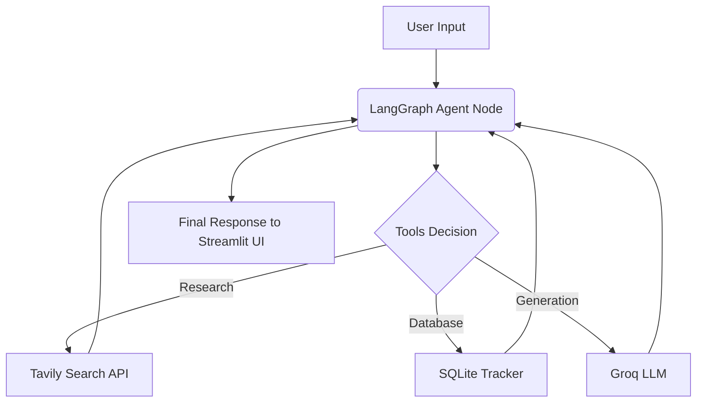

# 🎯 JobHunterAI - Autonomous Career Copilot


**JobHunterAI** adalah sistem *Autonomous AI Agent* berbasis **LangGraph** yang dirancang untuk mengotomatisasi siklus riset karir dan *cold outreach*. Agent ini bertindak sebagai asisten karir proaktif yang dapat menganalisis pasar, melakukan riset mendalam pada perusahaan target, menyusun email personal, dan melacak status lamaran pekerjaan.

Proyek ini dibangun sebagai portofolio pengembangan **Agentic AI Workflow** menggunakan konsep *ReAct (Reasoning + Acting)*.

---

## ✨ Fitur Utama (Agent Capabilities)

Agent ini dibekali dengan berbagai *Tools* yang dapat ia gunakan secara mandiri berdasarkan konteks percakapan:

- 🔍 **Market Analyzer**: Menganalisis tren pasar dan *skill gaps* secara real-time berdasarkan *role* yang dituju (menggunakan Tavily Search).
- 🏢 **Company Research**: Mengekstraksi visi, misi, dan kultur perusahaan sebelum melamar untuk personalisasi yang maksimal.
- ✍️ **Cold Email Writer**: Merangkai email lamaran/koneksi secara otomatis yang disesuaikan dengan profil pengguna dan hasil riset perusahaan.
- 📊 **Application Tracker**: Mencatat setiap lamaran yang dikirim ke database SQLite lokal secara mandiri.
- 🔔 **Follow-up Checker**: Mengidentifikasi lamaran yang sudah masuk masa tenggang (ghosting) dan perlu di-*follow up*.

---

## 🏗️ Arsitektur Agent

Sistem ini menggunakan arsitektur **LangGraph StateGraph** dengan siklus `Agent -> Tools -> Agent`.



## 💻 Tech Stack

- **LLM Engine:** Groq (Llama 3.3 70B) — *High-speed inference untuk pengalaman interaktif.*
- **Search Tool:** Tavily API — *Riset web yang dioptimalkan untuk LLM.*
- **Orchestration:** LangGraph (0.2+)
- **Memory & State:** SQLite & LangGraph Checkpointer
- **User Interface:** Streamlit
- **CI/CD:** GitHub Actions (Automated Pytest)

---

## 🚀 Quick Start (Local Setup)

```bash
# 1. Clone Repository
git clone https://github.com/fauzinoorsyabani/jobhunterai.git
cd jobhunterai

# 2. Setup Virtual Environment
python -m venv venv
source venv/bin/activate  # Untuk Windows: venv\Scripts\activate
pip install -r requirements-dev.txt

# 3. Environment Variables
cp .env.example .env
# Edit file .env dan masukkan API Keys Anda (Groq, Tavily)

# 4. Jalankan Aplikasi
streamlit run ui/app.py
```

## 🔑 API Keys Requirement
Semua dependensi menggunakan *free-tier* API:
- `GROQ_API_KEY`: Dapatkan dari [console.groq.com](https://console.groq.com)
- `TAVILY_API_KEY`: Dapatkan dari [tavily.com](https://tavily.com)

---
*Developed by Fauzi Noorsyabani - 2026*
